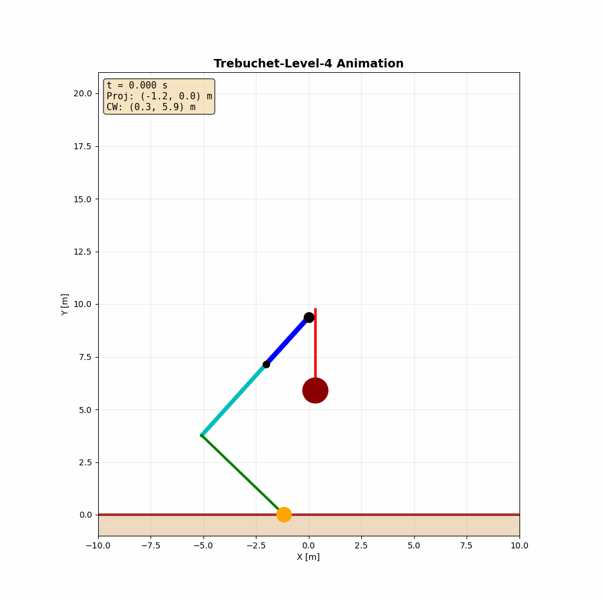
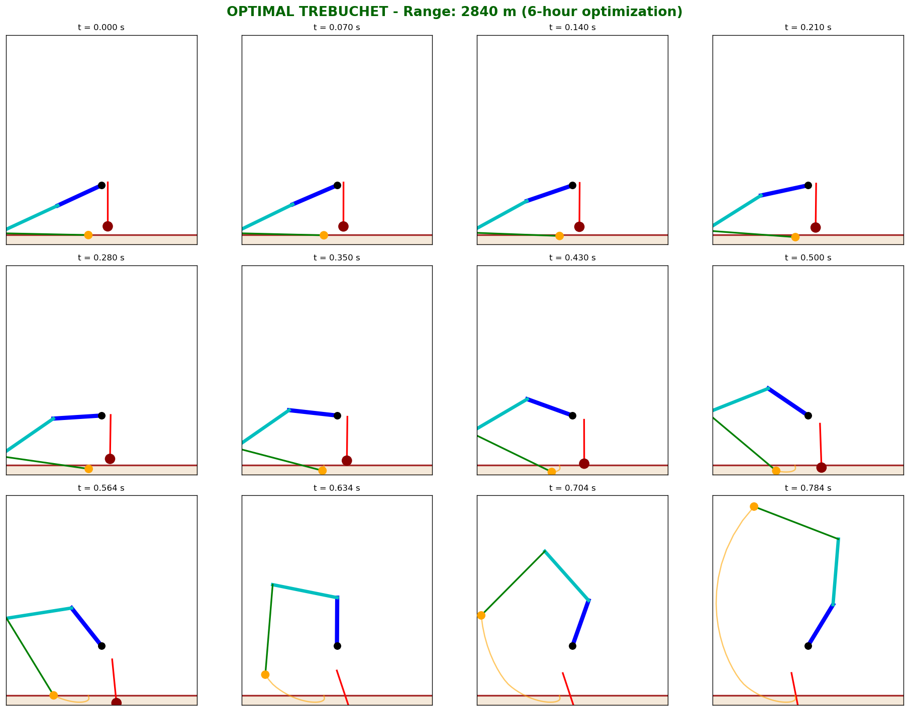

# Trebuchet Simulator

    

Physics-based trebuchet simulator with 4 degrees of freedom, symbolic equation derivation via SymPy, and automated design optimization using genetic algorithms.

Built for a virtual trebuchet competition: maximize projectile range under physical constraints (20m machine envelope, 10-ton counterweight limit, 300g max acceleration).



## Features

- **4-DoF Lagrangian mechanics** with Pseudo-Rigid-Body Model (PRBM) for flexible beam
- **Symbolic derivation** of equations of motion via SymPy, auto-generated as NumPy code
- **3-phase simulation**: sliding start, constrained swing, ballistic flight with air drag
- **Cam-driven counterweight** with C1-continuous spline profile
- **Genetic algorithm optimization** (scipy `differential_evolution`) with constraint handling
- **Interactive visualization** with real-time animation, energy plots, and angle tracking

## Architecture

```
derive_physics.py      SymPy: symbolic Lagrangian → equations of motion
        ↓
generated_eom.py       Auto-generated NumPy code (mass matrix M, force vector F)
        ↓
trebuchet_model.py     3-phase ODE simulation (slide → swing → ballistics)
        ↓
optimizer.py           Differential evolution + parameter study
        ↓
main_gui.py            Matplotlib animation + energy/angle/tension plots
```

## Physics Model

**Generalized coordinates:**
| Symbol | Description |
|--------|-------------|
| θ (theta) | Main beam angle from vertical |
| β (beta) | Flex angle (tip relative to root) — PRBM |
| γ (gamma) | Counterweight hanger angle |
| φ (phi) | Sling angle relative to beam tip |

**Simulation phases:**
1. **Slide** — projectile slides on rail, sling angle locked (φ = θ)
2. **Swing** — free rotation of all 4 DoF, event detection for release/collision/overload
3. **Ballistics** — projectile in free flight with quadratic air drag

**Constraints:**
- Machine must fit in a 20m cube
- Counterweight ≤ 10,000 kg
- Projectile acceleration ≤ 300g
- No ground collision, no rope slack

## Optimization Results

Best configuration found (6-hour optimization run):

| Parameter | Value |
|-----------|-------|
| Range | **2,840 m** |
| Beam root | 5.05 m |
| Beam tip | 6.91 m |
| Counterweight | 9,995 kg |
| Pivot height | 5.22 m |
| Sling length | 9.48 m |
| Release angle | 70.1° |



## Usage

### Run simulation with optimal parameters
```bash
python main_gui.py
```

### Run with default parameters
```bash
python main_gui.py --default
```

### Show trajectory only
```bash
python main_gui.py --trajectory
```

### Compare configurations
```bash
python main_gui.py --compare
```

### Run optimization
```bash
python optimizer.py           # Full optimization
python optimizer.py --test    # Quick test run
python optimizer.py --study   # Parameter sensitivity study
```

### Regenerate equations of motion
```bash
python derive_physics.py
```

## Tech Stack

`Python` `NumPy` `SciPy` `SymPy` `Matplotlib`

## Requirements

```
pip install -r requirements.txt
```
